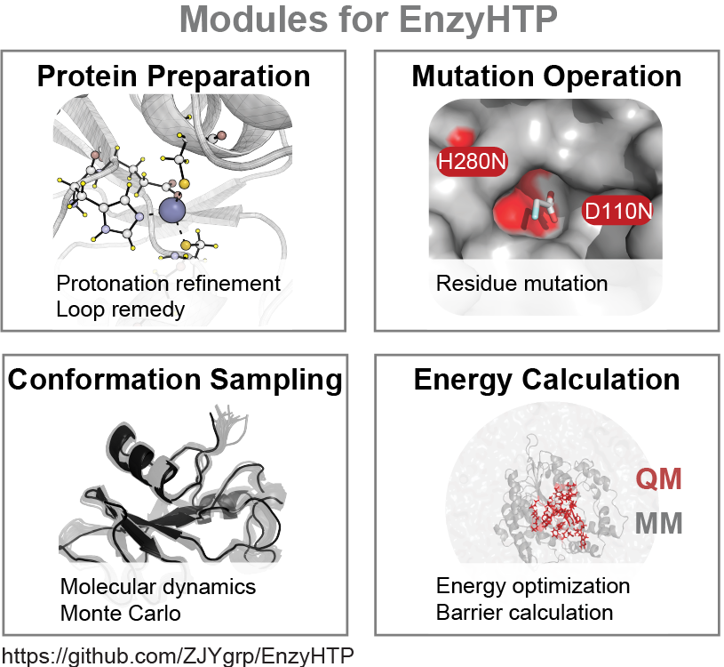

# EnzyHTP
  We built a holistic platform EnzyHTP that allows the molecular simulation of enzymes in a high-throughput manner. Molecular simulations, such as quantum mechanics (QM), molecular mechanics (MM), and QM/MM modeling, have been widely applied to guide the design and discovery of new biocatalysts. They inform the time-resolved, atomic (even electronic) detail of enzymatic reactions, which complements the sequence and structure-level information obtained in experiments. As such, augmenting molecular simulation data holds great promise to improve the predictive power of machine learning models to evaluate mutation effects for enzyme catalysis. However, large-scale collection of molecular simulation data presents a big challenge. Multiple hierarchies of structural treatments are necessary for building a simulation-ready enzyme model, including determining protein stoichiometry, identifying the binding site, predicting amino acid protonation state, adding missing residues, performing an amino acid substitution, creating reacting species, and so on. In most enzyme modeling practices, these structural operations rely on manual curation, which is highly inefficient and hampers reproducibility. Here we are developing a high-throughput enzyme simulation tool, EnzyHTP, that automates molecular model construction, mutation, sampling, and energy calculation.


# Documentation
Currently we are still preparing documentations for EnzyHTP and the code itself is under refactoring. The document is expected to online along with the refactored code. 
For now, you can check our paper (https://pubs.acs.org/doi/10.1021/acs.jcim.1c01424) and corresponding use cases under /Test_file/FAcD_expanse

# Requirement
## External Program
- AmberTool/Amber
- Gaussian
- Multiwfn (for wavefunction analysis)
## Python Package
- python >= 3.6
- numpy
- pdb2pqr
- openbabel
- mdtraj
- pymol-open-source

# Installation 
## dependence
0. Install conda & create an environment
1. install numpy `conda install numpy`
2. install plum `conda install -c conda-forge plum-dispatch`
3. install pandas `conda install pandas`
4. install pandas `conda install mdtraj`
5. install pandas `conda install -c conda-forge pymol-open-source`
6. Install openbabel `conda install openbabel -c conda-forge`
7. Install pdb2pqr 
```
git clone https://github.com/Electrostatics/pdb2pqr.git
cd pdb2pqr
pip install .
```
8. Install Multiwfn (install demo in author's blog: http://bbs.keinsci.com/thread-12020-1-1.html) (The LMO func seems not working for WSL) (Note that run Multiwfn on ACCRE requires loading the GCC module) 
