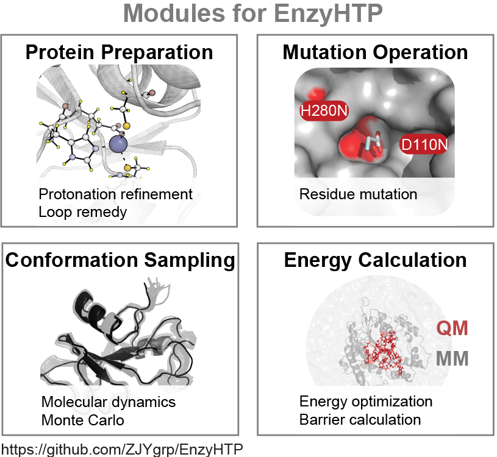

[](https://zenodo.org/badge/latestdoi/459668860)
[](https://github.com/google/yapf/actions)

# EnzyHTP
  EnzyHTP is a holistic platform that allows high-throughput molecular simulation of enzymes. Molecular simulations, such as quantum mechanics (QM), molecular mechanics (MM), and QM/MM modeling, are highly applicable to the design and discovery of new biocatalysts. Molecular simulations provide time-resolved, atomic and electronic detail for enzymatic reactions, complementing experimental sequence and structure-level information. As such, expanding molecular simulation data can improve the predictive power of machine learning models to evaluate mutation effects in enzyme catalysis. However, large-scale collection of molecular simulation data presents a significant challenge due to complex demands. To build an enzyme model appropriate for simulations, multiple hierarchies of structural definitions and treatments must be established such as protein stoichiometry, binding site, predicting amino acid protonation state, addition of missing residues, performing an amino acid substitution, and creating reacting species. Most enzyme modeling practices use similar structural operations but rely on manual curation, which is highly inefficient and hampers reproducibility. EnzyHTP, a high-throughput enzyme simulation tool, bypasses these issues through automation of molecular model construction, mutation, sampling and energy calculation.


# Documentation
Complete documentation for EnzyHTP is in progress, and its code is under refactoring. Stay tuned for documentation and the refactored code. For an in-depth description of EnzyHTP, please refer to our paper (https://pubs.acs.org/doi/10.1021/acs.jcim.1c01424) and corresponding use cases under /Test_file/FAcD_expanse

# Requirement
## External Program
- AmberTool/Amber
- Gaussian
- Multiwfn (for wavefunction analysis)
## Python Package
- python >= 3.6
- numpy
- pdb2pqr
- openbabel
- mdtraj
- pymol-open-source

# Installation 
## dependence
0. Install conda & create an environment
1. install numpy `conda install numpy`
2. install plum `conda install -c conda-forge plum-dispatch`
3. install pandas `conda install pandas`
4. install pandas `conda install mdtraj`
5. install pandas `conda install -c conda-forge pymol-open-source`
6. Install openbabel `conda install openbabel -c conda-forge`
7. Install pdb2pqr 

```
git clone https://github.com/Electrostatics/pdb2pqr.git
cd pdb2pqr
pip install .
```

9. Install [AmberTool](https://ambermd.org/AmberTools.php)
10. (optional) Install RDKit `conda install -c conda-forge rdkit`
11. (optional) Install Gaussian16 
12. (optional) Install Multiwfn (In section 2.1.2 of the [manual](http://sobereva.com/multiwfn/)) (The LMO func seems not working for WSL) (Note that run Multiwfn on ACCRE requires loading the GCC module) 

